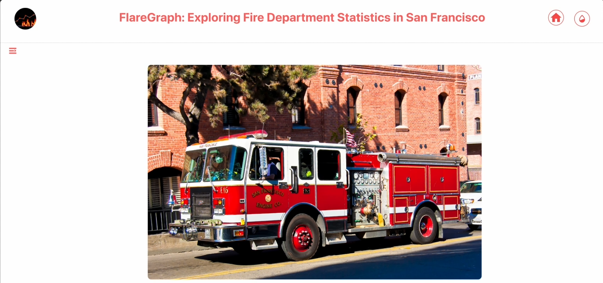
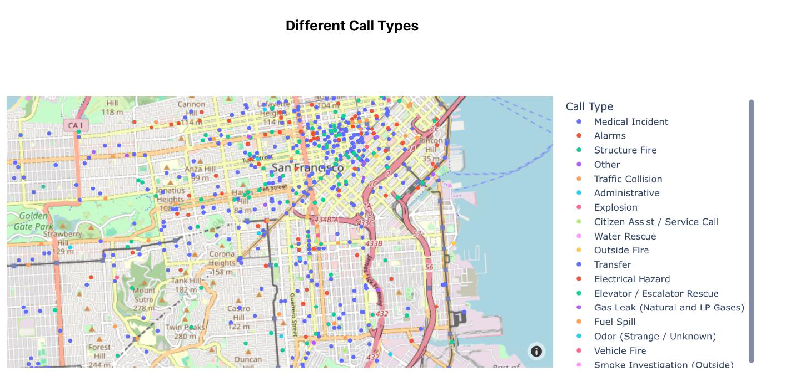

# FlareGraph
## Summary
This project presents a collaborative effort on fire department statistics in San Francisco using data visualization tools like Dash and Python. The dashboard showcases various visualizations and insights aimed at improving fire safety measures.

## Screenshots

### Landing Page


### Visualization Example


## Highlights
- **Collaborative effort on fire department statistics in San Francisco** 🚒
- **Utilization of Dash framework with Python for interactive data visualizations** 📊
- **Emphasis on making data accessible and engaging for users through an interactive web app** 🌐
- **Exploration of different data visualization types like bubble charts, line charts, and bar charts** 📈
- **Insights on primary causes for fire-related calls and trends in fire incidents over the years** 🔥
- **In-depth analysis of feature correlations and response time by neighborhood districts** ⏳
- **Recommendations for community awareness programs and collaborative approaches for fire safety** 🏘️

## Key Insights
- **Interactive Data Exploration**: The interactive web app allows users to dive deep into fire department statistics, making data more accessible and engaging for a wider audience. 🖥️
- **Effective Visualization Techniques**: Various data visualizations, such as bubble charts, line charts, and bar charts, provide different perspectives on fire incidents, enabling users to extract meaningful insights. 📊
- **Community Safety Recommendations**: Actionable recommendations like community awareness programs and establishing a community task force to improve fire safety measures in high-risk areas. 🚨
- **Data-driven Decision Making**: Feature analysis and correlation studies uncover crucial insights, such as the relationship between fire incidents and response times, empowering stakeholders to make informed decisions. 📈
- **Comprehensive Trend Analysis**: Trend analysis of fire incidents over the years provides valuable insights into the changing landscape of fire safety in San Francisco. 📆
- **Enhanced User Experience**: Integration of dark mode and interactive data visualizations ensures users can easily navigate and explore the data for a more enriching experience. 🌙
- **Holistic Approach to Fire Safety**: The project highlights community engagement and preventive measures, demonstrating a commitment to fostering a safer environment for residents and businesses in San Francisco. 🧯

## Installation

To run this project locally, follow these steps:

1. **Clone the repository:**
    ```bash
    git clone https://github.com/yourusername/sf-fire-department-dashboard.git
    cd sf-fire-department-dashboard
    ```

2. **Create and activate a virtual environment:**
    ```bash
    python3 -m venv venv
    source venv/bin/activate  # On Windows use `venv\Scripts\activate`
    ```

3. **Install the required dependencies:**
    ```bash
    pip install -r requirements.txt
    ```

4. **Run the Dash app:**
    ```bash
    python app.py
    ```

## Walkthrough Video

Click [here](./assets/Video%20Walkthrough.mp4) to watch the video.


## Usage

1. After running the app, open your web browser and go to `http://127.0.0.1:8050/`.
2. Explore the various visualizations and insights on fire department statistics.
3. Use the interactive features to filter and drill down into specific data points.

## Contributing

Contributions are welcome! Please follow these steps:

1. **Fork the repository.**
2. **Create a new branch:**
    ```bash
    git checkout -b feature-branch
    ```
3. **Make your changes and commit them:**
    ```bash
    git commit -m "Add some feature"
    ```
4. **Push to the branch:**
    ```bash
    git push origin feature-branch
    ```
5. **Submit a pull request.**

## License

This project is licensed under the MIT License - see the [LICENSE](LICENSE) file for details.

## Acknowledgements

- Special thanks to the San Francisco Fire Department for providing the data.
- Thanks to the Dash community for their support and resources.

